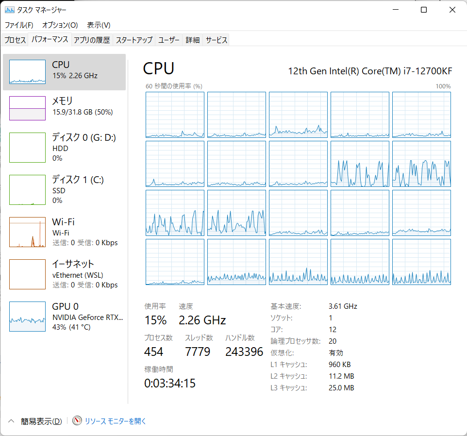

# プログラミング応用 信号処理技術レポート

## 学籍番号: 32114066

## 名前: 佐伯 晃

## 使用計算機環境情報

* CPU: 
* メモリ: 32GB
* OS: Windows 11 with WSL2
* コンパイラ: gcc

CPUの詳細情報は以下等で調べてください．
https://en.wikichip.org/wiki/WikiChip



# 画像処理課題

## imagemagick で様々な画像処理を実行せよ．

imagemagickを使って画像をセピアカラーに変換した．
コマンドは下記である

```bash
convert lena.jpg sepia tone 100% out.jpg
```

また，入出力は下記となった．


図：（左）入力画像，（右）セピア化画像

**そのほかいくつかやってみること．**

## image/lena.ppm の 画像中 の インパルス雑音を消せ．

答えになるので略．

# レベル１

レベル１の課題を，コンパイルオプションや実行オプションを変えながら，下記コマンドで実行時間の計測と動作のチェックを行った．
（冒頭には何をやったかを端的に書いてください．）

```bash
time sh run.sh level1
sh answer.sh result level1
```

Makefileのコンパイルやスクリプト内のmatchingのコマンドライン下記のように複数の組み合わせで変更した．表１に結果を示す．

1. 全てデフォルト
2. コンパイルオプション-O1, 引数がデフォルトのcp
3. ｘｘｘｘｘ略．

表１：各コンパイルオプションとコマンドライン引数による実行時間

| オプション  | 引数            | 時間       |
| ------ | ------------- | -------- |
| デフォルト  | cp            | 0m0.178s |
| -O1    | cp            | 0m0.144s |
| -O2    | cpg           | 0m0.141s |
| -O3    | cpg           | 0m0.145s |
| -O3    | -mtune=native | 0m0.137s |
| -Ofast | cpg           | 0m0.137s |

なお，すべての場合で正答率は100％であった．

考察: ほとんど誤差であるように思う。

# レベル２

レベル２に対応するためにAとＢの変更を行った．

また，全体的に高速化するためにｘｘｘの変更を行った．この変更は以下のレベルすべて共通で用いている．

Ａの変更をした場合，Ｂの変更した場合それぞれの実行時間と正答率を表ｘｘｘおよび表ＹＹＹに示す．

考察：ＡはｘｘでＢはＸＸであった．

# レベル３

レベル3に対応するために`main.c`のテンプレートマッチング関数`templateMatchingGray`を修正した．
距離関数をSSDをSADに変更している．

（これはレポート用に適当に書いただけで，レベル３に効果がある保証は全くないです）．
ソースコードはこのようにはりつけられます．
できるだけ該当箇所を抜粋して．

```c
//SSD
for (j = 0; j < template->height; j++)
{
    for (i = 0; i < template->width; i++)
    {
        int v = (src->data[(y + j)*src->width + (x + i)] - template->data[j*template->width + i]);
        distance += abs(v);//ここを変更した．元はdistance += v*v;
    }
}
```

# レベル４

レベル４に対応するために`run.sh`において，事前の画像処理にヒストグラム平坦化を入れた．

（実際は効果があるかは知りません．）

```sh
#!/bin/sh
# imagemagickで何か画像処理をして，/imgprocにかきこみ，テンプレートマッチング
# 最終テストは，直下のforループを次に変更 for image in $1/final/*.ppm; do
for image in $1/test/*.ppm; do
    bname=`basename ${image}`
    name="imgproc/"$bname
    x=0        #
    echo $name
   convert -equalize "${image}" "${name}" # ここを変更した．
    rotation=0
    echo $bname:
    for template in $1/*.ppm; do
    echo `basename ${template}`
    if [ $x = 0 ]
    then
        ./matching $name "${template}" rotation 0.5 cp 
        x=1
    else
        ./matching $name "${template}" rotation 0.5 p 
    fi
    done
    echo ""
done
wait
```

# レベル５

高速な画像処理ライブラリであるOpenCVを使用するために，すべてをPythonで書き直した．
以下に書き直したPythonコードを示す．

ほぼジョークの類ですが，全部書き直してもいいです．制限は何もありません．

```py
for i in range(5):
    print("Hello World")
```

# レベル６

# レベル７

# FINAL

最終テストの結果を示す．
ｘｘｘ
